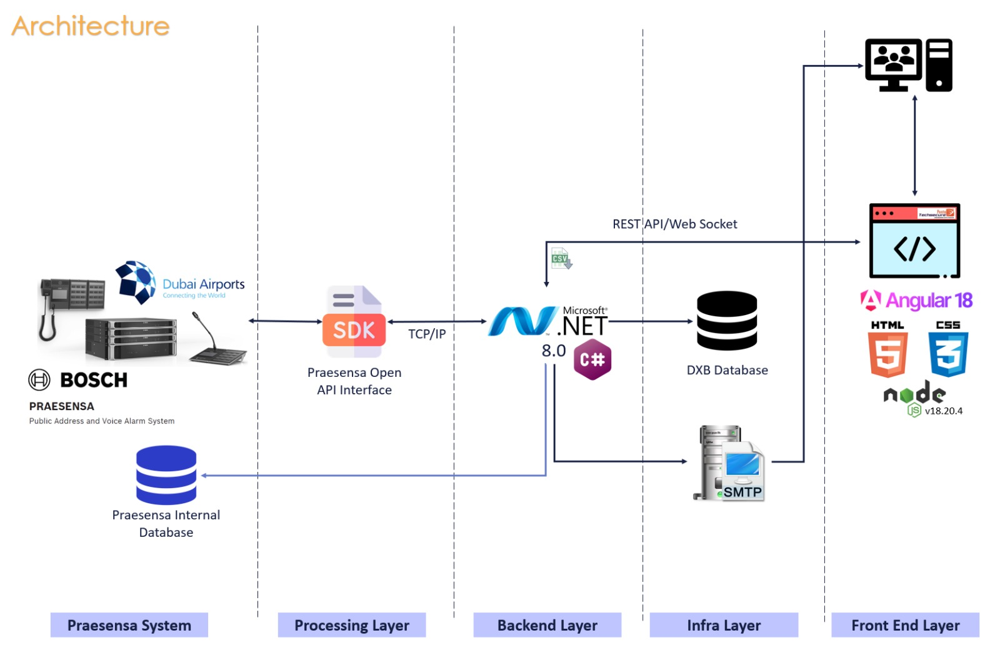

# PA-Dashboard

The dashboard for monitoring real time call notifications in the PA(Personal announcement) system and fault events.

<!-- TOC -->
* [PA-Dashboard](#pa-dashboard)
    * [Overview](#overview-)
    * [Technical Stack](#technical-stack)
    * [Setup](#setup)
<!-- TOC -->


### Overview 



### Technical Stack
- **.NET Web API:** C#, .net 8
- **UI:** Angular, Typescript
- **Container:** Docker  , Docker Compose
- **Realtime Processing**: SignalR

### Setup

The app by default runs using a mock client to stub Praesensa system events.

To run the app start the dashboard app using

```
    ./startDashBoard.sh
```

To run the app with the mock client disabled

```
    ./startDashBoard.sh --MOCK-CLIENT false
```

To stop the app run the command

```
    ./stopDashBoard.sh
```